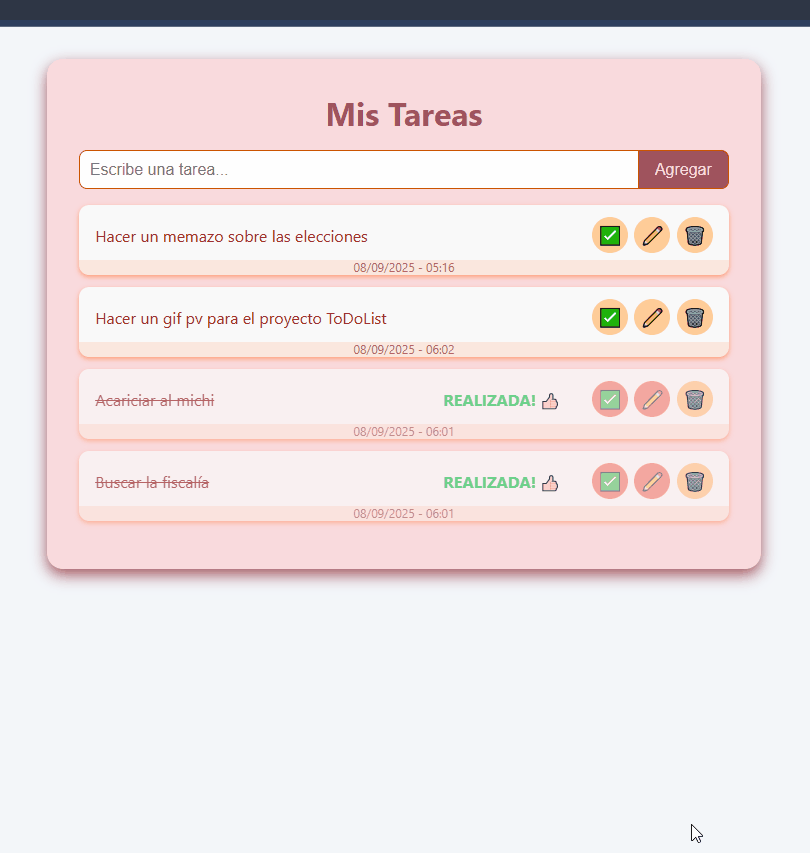

# 📝 To-Do List en JavaScript Vanilla

Proyecto de lista de tareas implementado en **JavaScript vanilla** para practicar y demostrar manejo de **DOM**, **eventos** y **almacenamiento local (`localStorage`)**.  

## 📌 Estado del proyecto
✔️ **Completado y funcional**  
*(abierto a mejoras estéticas y nuevas características)*

## ✨ Funcionalidades
- ➕ **Agregar tareas** con fecha y hora de creación.  
- ✏️ **Editar tareas** con opción de guardar o cancelar cambios.  
- ✅ **Marcar tareas como realizadas**, con reordenamiento automático al final de la lista.  
- 💾 **Persistencia** de datos usando `localStorage`.  
- 🗑️ **Eliminar tareas**, incluso las ya completadas.  
- 🎨 **Interfaz amigable** con colores pastel y feedback visual.  
- 🔄 **Botones dinámicos** que cambian según el estado de la tarea (hecha / editable / eliminada).  

## 🚀 Instrucciones de uso
1. Clonar el repositorio:  
   ```bash
   git clone https://github.com/GreatBahamut/bahamut-to-do-list

2. Abrir el archivo index.html en cualquier navegador.

3. ¡Listo! No requiere servidor ni dependencias externas.

## 🖼️ Vista previa



## 🛠️ Tecnologías usadas

- JavaScript (Vanilla)

- HTML5

- CSS3

## 📈 Mejoras futuras

- 🔍 Filtros: mostrar todas / pendientes / realizadas.

- 🎨 Temas de colores personalizables.

- 📤 Exportar lista a archivo (txt / json).

- 📱 Optimización mobile con diseño responsive avanzado.